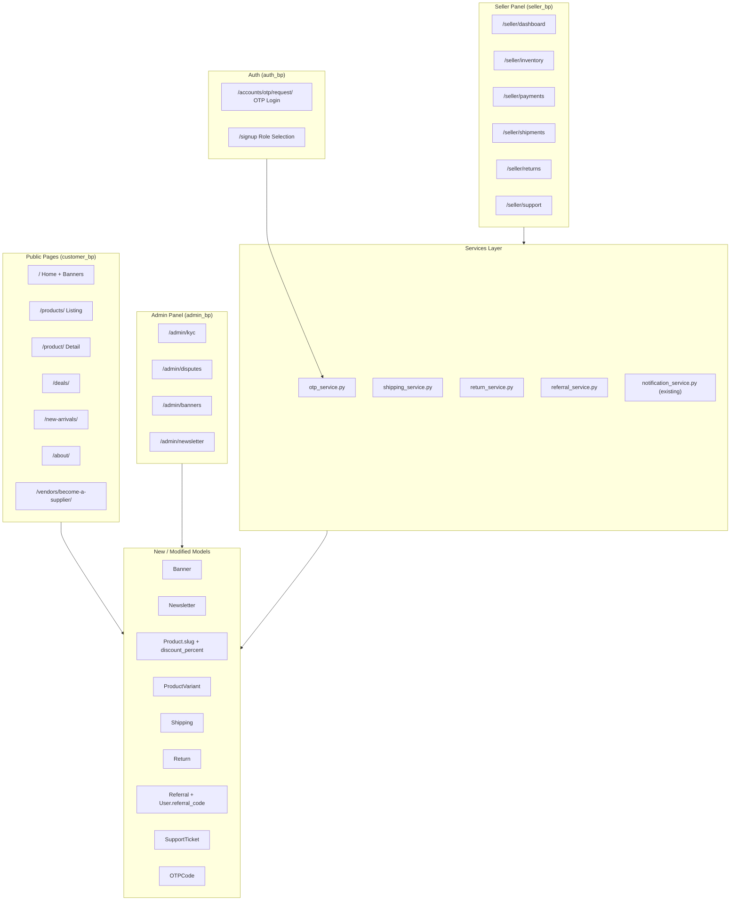
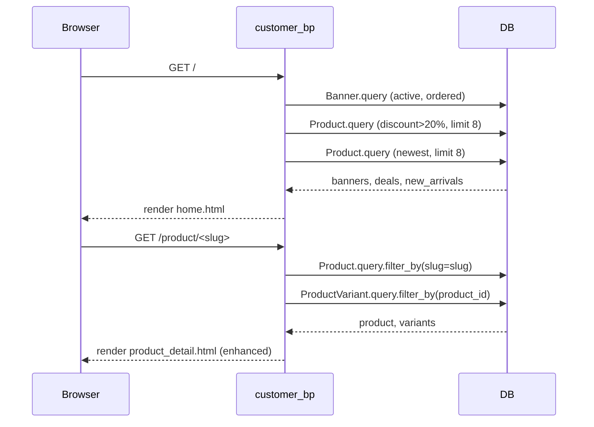
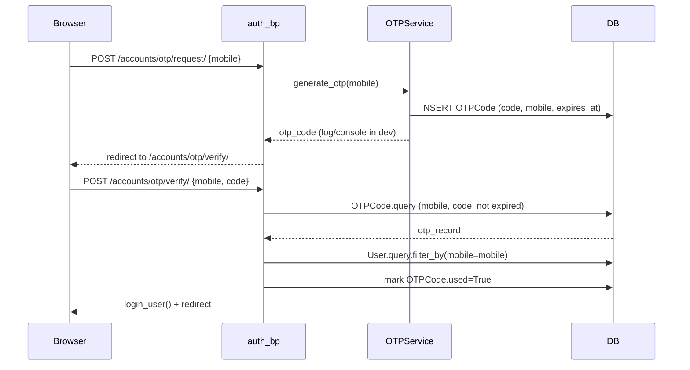

# Design Document: Meesho Marketplace Expansion

## Overview

This document covers all additions and modifications needed to expand the existing **shopwave** Flask application into a full Meesho-style marketplace. The existing app already has auth, seller/customer/admin blueprints, a payment service, and 13 SQLAlchemy models. Everything described here is **net-new or a targeted modification** — nothing already working is replaced.

The expansion adds: rich public storefront pages, OTP-based mobile login, product slugs & variants, shipping/returns/referrals/support tickets, banner management, newsletter subscriptions, and enhanced seller/admin panels.

---

## Architecture

### High-Level Component Map



### Request Flow — New Public Pages



### OTP Login Flow



---

## Modified Existing Files

| File | Change |
|------|--------|
| `shopwave/app/models.py` | Add 8 new models; add columns to `User` and `Product` |
| `shopwave/app/customer/routes.py` | Add 6 new routes; update `index()` and `product_detail()` |
| `shopwave/app/auth/routes.py` | Add OTP request/verify routes |
| `shopwave/app/seller/routes.py` | Add inventory, payments, shipments, returns, support routes |
| `shopwave/app/admin/routes.py` | Add KYC, disputes, banners, newsletter routes |
| `shopwave/app/__init__.py` | Register new `services`; no blueprint changes needed |
| `shopwave/config.py` | Add `OTP_EXPIRY_MINUTES`, `OTP_RATE_LIMIT` config keys |

## New Files

| File | Purpose |
|------|---------|
| `shopwave/app/services/otp_service.py` | OTP generation, rate-limit check, verification |
| `shopwave/app/services/shipping_service.py` | Create/update Shipping records |
| `shopwave/app/services/return_service.py` | Initiate/approve/reject returns |
| `shopwave/app/services/referral_service.py` | Generate referral codes, credit referral rewards |
| `shopwave/app/templates/customer/home.html` | New home page (banners, deals, new arrivals) |
| `shopwave/app/templates/customer/products.html` | Enhanced product listing grid |
| `shopwave/app/templates/customer/deals.html` | Deals page |
| `shopwave/app/templates/customer/new_arrivals.html` | New arrivals page |
| `shopwave/app/templates/customer/about.html` | Static about page |
| `shopwave/app/templates/customer/become_supplier.html` | Vendor landing page |
| `shopwave/app/templates/auth/otp_request.html` | Mobile OTP entry form |
| `shopwave/app/templates/auth/otp_verify.html` | OTP code entry form |
| `shopwave/app/templates/seller/inventory.html` | Inventory management |
| `shopwave/app/templates/seller/payments.html` | Payments & settlements |
| `shopwave/app/templates/seller/shipments.html` | Shipment tracking |
| `shopwave/app/templates/seller/returns.html` | Returns management |
| `shopwave/app/templates/seller/support.html` | Support tickets |
| `shopwave/app/templates/admin/kyc.html` | KYC approval queue |
| `shopwave/app/templates/admin/disputes.html` | Dispute/return handling |
| `shopwave/app/templates/admin/banners.html` | Banner CRUD |
| `shopwave/app/templates/admin/newsletter.html` | Newsletter subscriber list |

---

## Updated Data Models

### Modifications to Existing Models

#### `User` — add columns
```python
mobile         = db.Column(db.String(15), unique=True, nullable=True)
referral_code  = db.Column(db.String(20), unique=True, nullable=True)
kyc_status     = db.Column(db.String(20), default='none')  # none|pending|approved|rejected
is_active      = db.Column(db.Boolean, default=True)
```

#### `Product` — add columns
```python
slug             = db.Column(db.String(220), unique=True, nullable=True)
discount_percent = db.Column(db.Float, default=0.0)   # 0–100
images           = db.Column(db.Text, default='')     # comma-separated filenames
```
- `slug` is auto-generated from `name` on save (same `_slugify` pattern already used for shops)
- `images` stores up to 5 image filenames; first image is the primary

### New Models

#### `Banner`
```python
class Banner(db.Model):
    __tablename__ = 'banners'
    id         = db.Column(db.Integer, primary_key=True)
    title      = db.Column(db.String(200), nullable=False)
    image      = db.Column(db.String(300), nullable=False)
    link       = db.Column(db.String(300), default='')
    position   = db.Column(db.Integer, default=0)   # sort order
    is_active  = db.Column(db.Boolean, default=True)
    created_at = db.Column(db.DateTime, default=datetime.utcnow)
```

#### `Newsletter`
```python
class Newsletter(db.Model):
    __tablename__ = 'newsletter'
    id           = db.Column(db.Integer, primary_key=True)
    email        = db.Column(db.String(120), unique=True, nullable=False)
    subscribed_at = db.Column(db.DateTime, default=datetime.utcnow)
    is_active    = db.Column(db.Boolean, default=True)
```

#### `ProductVariant`
```python
class ProductVariant(db.Model):
    __tablename__ = 'product_variants'
    id         = db.Column(db.Integer, primary_key=True)
    product_id = db.Column(db.Integer, db.ForeignKey('products.id'), nullable=False)
    size       = db.Column(db.String(50), default='')
    color      = db.Column(db.String(50), default='')
    price      = db.Column(db.Float, nullable=False)
    stock      = db.Column(db.Integer, default=0)
    sku        = db.Column(db.String(100), default='')
```
- Relationship added to `Product`: `variants = db.relationship('ProductVariant', backref='product', lazy=True, cascade='all,delete-orphan')`

#### `OTPCode`
```python
class OTPCode(db.Model):
    __tablename__ = 'otp_codes'
    id         = db.Column(db.Integer, primary_key=True)
    mobile     = db.Column(db.String(15), nullable=False)
    code       = db.Column(db.String(6),  nullable=False)
    is_used    = db.Column(db.Boolean, default=False)
    expires_at = db.Column(db.DateTime, nullable=False)
    created_at = db.Column(db.DateTime, default=datetime.utcnow)
```

#### `Shipping`
```python
class Shipping(db.Model):
    __tablename__ = 'shipping'
    id              = db.Column(db.Integer, primary_key=True)
    order_id        = db.Column(db.Integer, db.ForeignKey('orders.id'), unique=True, nullable=False)
    carrier         = db.Column(db.String(100), default='')
    tracking_number = db.Column(db.String(100), default='')
    status          = db.Column(db.String(50), default='pending')
    # pending | dispatched | in_transit | out_for_delivery | delivered | returned
    estimated_delivery = db.Column(db.DateTime, nullable=True)
    updated_at      = db.Column(db.DateTime, default=datetime.utcnow, onupdate=datetime.utcnow)
    created_at      = db.Column(db.DateTime, default=datetime.utcnow)

    order = db.relationship('Order', backref=db.backref('shipping', uselist=False))
```

#### `Return`
```python
class Return(db.Model):
    __tablename__ = 'returns'
    id           = db.Column(db.Integer, primary_key=True)
    order_id     = db.Column(db.Integer, db.ForeignKey('orders.id'), nullable=False)
    customer_id  = db.Column(db.Integer, db.ForeignKey('users.id'),  nullable=False)
    reason       = db.Column(db.Text, nullable=False)
    status       = db.Column(db.String(30), default='requested')
    # requested | approved | rejected | refunded
    refund_amount = db.Column(db.Float, default=0.0)
    admin_note   = db.Column(db.Text, default='')
    created_at   = db.Column(db.DateTime, default=datetime.utcnow)
    updated_at   = db.Column(db.DateTime, default=datetime.utcnow, onupdate=datetime.utcnow)
```

#### `Referral`
```python
class Referral(db.Model):
    __tablename__ = 'referrals'
    id           = db.Column(db.Integer, primary_key=True)
    referrer_id  = db.Column(db.Integer, db.ForeignKey('users.id'), nullable=False)
    referred_id  = db.Column(db.Integer, db.ForeignKey('users.id'), nullable=False)
    reward_given = db.Column(db.Boolean, default=False)
    created_at   = db.Column(db.DateTime, default=datetime.utcnow)

    referrer = db.relationship('User', foreign_keys=[referrer_id], backref='referrals_made')
    referred = db.relationship('User', foreign_keys=[referred_id], backref='referred_by')
```

#### `SupportTicket`
```python
class SupportTicket(db.Model):
    __tablename__ = 'support_tickets'
    id          = db.Column(db.Integer, primary_key=True)
    user_id     = db.Column(db.Integer, db.ForeignKey('users.id'), nullable=False)
    subject     = db.Column(db.String(200), nullable=False)
    description = db.Column(db.Text, nullable=False)
    status      = db.Column(db.String(30), default='open')  # open | in_progress | resolved | closed
    priority    = db.Column(db.String(20), default='normal')  # low | normal | high
    admin_reply = db.Column(db.Text, default='')
    created_at  = db.Column(db.DateTime, default=datetime.utcnow)
    updated_at  = db.Column(db.DateTime, default=datetime.utcnow, onupdate=datetime.utcnow)

    user = db.relationship('User', backref='support_tickets')
```

---

## New & Modified Routes

### customer_bp — New Routes

| Method | URL | Handler | Description |
|--------|-----|---------|-------------|
| GET | `/` | `home()` | **Replaces** `index()` — banners, deals, new arrivals, newsletter form |
| GET | `/products/` | `product_listing()` | Enhanced grid with filters (existing logic extracted here) |
| GET | `/product/<slug>` | `product_detail_slug()` | Slug-based detail with variants |
| GET | `/deals/` | `deals()` | Products with `discount_percent > 20` |
| GET | `/new-arrivals/` | `new_arrivals()` | Latest 40 products by `created_at` |
| GET | `/about/` | `about()` | Static render |
| GET | `/vendors/become-a-supplier/` | `become_supplier()` | Static landing with stats |
| POST | `/newsletter/subscribe` | `newsletter_subscribe()` | Save email to Newsletter table |

> The existing `customer.index` route at `/` becomes `home()`. The old search/filter logic moves to `/products/`.

#### `home()` — key logic
```python
@customer_bp.route('/')
def home():
    banners      = Banner.query.filter_by(is_active=True).order_by(Banner.position).limit(3).all()
    deals        = Product.query.filter(Product.discount_percent > 20, Product.stock > 0)\
                                .order_by(Product.discount_percent.desc()).limit(8).all()
    new_arrivals = Product.query.filter(Product.stock > 0)\
                                .order_by(Product.created_at.desc()).limit(8).all()
    categories   = [c[0] for c in db.session.query(Product.category).distinct().all()]
    return render_template('customer/home.html',
                           banners=banners, deals=deals,
                           new_arrivals=new_arrivals, categories=categories)
```

#### `product_detail_slug()` — key logic
```python
@customer_bp.route('/product/<slug>')
def product_detail_slug(slug):
    product  = Product.query.filter_by(slug=slug).first_or_404()
    variants = ProductVariant.query.filter_by(product_id=product.id).all()
    images   = [i for i in product.images.split(',') if i] if product.images else [product.image]
    related  = Product.query.filter(Product.category == product.category,
                                    Product.id != product.id, Product.stock > 0).limit(4).all()
    user_review = None
    if current_user.is_authenticated:
        user_review = Review.query.filter_by(product_id=product.id,
                                             user_id=current_user.id).first()
    return render_template('customer/product_detail.html',
                           product=product, variants=variants, images=images,
                           related=related, user_review=user_review)
```

> The existing `/product/<int:pid>` route is kept for backward compatibility but redirects to the slug URL.

### auth_bp — New Routes

| Method | URL | Handler | Description |
|--------|-----|---------|-------------|
| GET/POST | `/accounts/otp/request/` | `otp_request()` | Enter mobile number |
| GET/POST | `/accounts/otp/verify/` | `otp_verify()` | Enter 6-digit OTP |

#### OTP rate limiting strategy
- No external library needed: count `OTPCode` rows for the mobile in the last hour
- If count >= 3, flash error and block
- OTP expires after `OTP_EXPIRY_MINUTES` (default 10) from `config.py`

```python
# otp_service.py
def can_request_otp(mobile: str) -> bool:
    one_hour_ago = datetime.utcnow() - timedelta(hours=1)
    count = OTPCode.query.filter(
        OTPCode.mobile == mobile,
        OTPCode.created_at >= one_hour_ago
    ).count()
    return count < 3

def generate_otp(mobile: str) -> str:
    code = str(random.randint(100000, 999999))
    expires = datetime.utcnow() + timedelta(minutes=current_app.config['OTP_EXPIRY_MINUTES'])
    db.session.add(OTPCode(mobile=mobile, code=code, expires_at=expires))
    db.session.commit()
    return code  # In production: send via SMS gateway

def verify_otp(mobile: str, code: str) -> bool:
    record = OTPCode.query.filter_by(mobile=mobile, code=code, is_used=False)\
                          .filter(OTPCode.expires_at > datetime.utcnow())\
                          .order_by(OTPCode.created_at.desc()).first()
    if not record:
        return False
    record.is_used = True
    db.session.commit()
    return True
```

### seller_bp — New Routes

| Method | URL | Handler | Description |
|--------|-----|---------|-------------|
| GET | `/seller/inventory` | `inventory()` | Stock levels across all products + variants |
| POST | `/seller/inventory/<pid>/update` | `update_inventory()` | Adjust stock |
| GET | `/seller/payments` | `payments()` | Settlements timeline (extends existing earnings) |
| GET | `/seller/shipments` | `shipments()` | All shipments for seller's orders |
| POST | `/seller/shipments/<oid>/update` | `update_shipment()` | Set carrier/tracking |
| GET | `/seller/returns` | `seller_returns()` | Return requests for seller's products |
| POST | `/seller/returns/<rid>/respond` | `respond_return()` | Approve/reject return |
| GET/POST | `/seller/support` | `support_tickets()` | View/create support tickets |
| POST | `/seller/support/new` | `create_ticket()` | Submit new ticket |

### admin_bp — New Routes

| Method | URL | Handler | Description |
|--------|-----|---------|-------------|
| GET | `/admin/kyc` | `kyc_queue()` | Sellers with `kyc_status=pending` |
| POST | `/admin/kyc/<uid>/action` | `kyc_action()` | Approve/reject KYC |
| GET | `/admin/disputes` | `disputes()` | All Return records |
| POST | `/admin/disputes/<rid>/action` | `dispute_action()` | Approve/reject/refund |
| GET | `/admin/banners` | `banners()` | List banners |
| POST | `/admin/banners/add` | `add_banner()` | Upload new banner |
| POST | `/admin/banners/<bid>/delete` | `delete_banner()` | Remove banner |
| GET | `/admin/newsletter` | `newsletter()` | Subscriber list |

---

## Service Layer

### `otp_service.py`
Functions: `can_request_otp(mobile)`, `generate_otp(mobile)`, `verify_otp(mobile, code)`

### `shipping_service.py`
```python
def create_shipping(order_id: int) -> Shipping:
    """Called when order status moves to 'confirmed'."""

def update_tracking(order_id: int, carrier: str, tracking_number: str,
                    status: str, estimated_delivery=None) -> Shipping:
    """Seller or admin updates shipment info."""
```

### `return_service.py`
```python
def request_return(order_id: int, customer_id: int, reason: str) -> Return:
    """Customer initiates return. Validates order is 'delivered'."""

def process_return(return_id: int, action: str, refund_amount: float,
                   admin_note: str, actor_id: int) -> Return:
    """Admin approves/rejects. On approve: sets status='refunded', logs Notification."""
```

### `referral_service.py`
```python
def generate_referral_code(user_id: int) -> str:
    """Creates a unique 8-char alphanumeric code, stores on User.referral_code."""

def apply_referral(new_user: User, referral_code: str) -> bool:
    """On signup: find referrer, create Referral record, mark reward_given=False."""

def credit_referral_reward(referral_id: int) -> None:
    """Called after referred user places first order. Marks reward_given=True,
    sends Notification to referrer."""
```

---

## Updated Folder Structure

```
shopwave/
├── app/
│   ├── __init__.py                    [MODIFY: no blueprint changes, ensure db.create_all covers new models]
│   ├── models.py                      [MODIFY: add 8 models, modify User + Product]
│   ├── admin/
│   │   └── routes.py                  [MODIFY: add kyc, disputes, banners, newsletter routes]
│   ├── auth/
│   │   └── routes.py                  [MODIFY: add otp_request, otp_verify routes]
│   ├── customer/
│   │   └── routes.py                  [MODIFY: replace index→home, add 7 new routes]
│   ├── seller/
│   │   └── routes.py                  [MODIFY: add inventory, payments, shipments, returns, support routes]
│   ├── services/
│   │   ├── payment.py                 [EXISTING — unchanged]
│   │   ├── otp_service.py             [NEW]
│   │   ├── shipping_service.py        [NEW]
│   │   ├── return_service.py          [NEW]
│   │   └── referral_service.py        [NEW]
│   └── templates/
│       ├── base.html                  [MODIFY: add WhatsApp button, unread notification badge]
│       ├── customer/
│       │   ├── home.html              [NEW — replaces index.html as / route]
│       │   ├── index.html             [EXISTING — repurposed for /products/ listing]
│       │   ├── product_detail.html    [MODIFY: add image gallery, variant selector]
│       │   ├── deals.html             [NEW]
│       │   ├── new_arrivals.html      [NEW]
│       │   ├── about.html             [NEW]
│       │   └── become_supplier.html   [NEW]
│       ├── auth/
│       │   ├── otp_request.html       [NEW]
│       │   └── otp_verify.html        [NEW]
│       ├── seller/
│       │   ├── inventory.html         [NEW]
│       │   ├── payments.html          [NEW]
│       │   ├── shipments.html         [NEW]
│       │   ├── returns.html           [NEW]
│       │   └── support.html           [NEW]
│       └── admin/
│           ├── kyc.html               [NEW]
│           ├── disputes.html          [NEW]
│           ├── banners.html           [NEW]
│           └── newsletter.html        [NEW]
└── config.py                          [MODIFY: add OTP_EXPIRY_MINUTES, OTP_RATE_LIMIT]
```

---

## Key Implementation Details

### Product Slug Generation

Slugs are auto-generated on `Product` creation using the same `_slugify` helper already in `auth/routes.py`. Move `_slugify` to a shared `app/utils.py` and import it in both `auth/routes.py` and `seller/routes.py`.

Uniqueness: append `-2`, `-3` etc. if slug already exists:
```python
def unique_product_slug(name: str) -> str:
    base = _slugify(name)
    slug, n = base, 1
    while Product.query.filter_by(slug=slug).first():
        n += 1
        slug = f'{base}-{n}'
    return slug
```

### Backward Compatibility — Product Detail URL

The existing `/product/<int:pid>` route stays but redirects:
```python
@customer_bp.route('/product/<int:pid>')
def product_detail(pid):
    product = Product.query.get_or_404(pid)
    if product.slug:
        return redirect(url_for('customer.product_detail_slug', slug=product.slug), 301)
    # fallback for products without slug
    return product_detail_slug_impl(product)
```

### Variant-Aware Add to Cart

When a product has variants, the cart form posts `variant_id`. `CartItem` gets an optional `variant_id` column:
```python
# CartItem modification
variant_id = db.Column(db.Integer, db.ForeignKey('product_variants.id'), nullable=True)
```
Price used for checkout is `variant.price` if `variant_id` is set, else `product.price`.

### Banner Slider

Home page renders up to 3 active banners ordered by `position`. Bootstrap 5 Carousel component is used — no JS library needed beyond what's already in the stack.

### Newsletter Subscription

Simple POST to `/newsletter/subscribe` with email. Upserts on unique constraint (re-subscribing reactivates `is_active=True`). No email sending in MVP — admin can export from `/admin/newsletter`.

### OTP Login — User Auto-Creation

If no `User` with the given mobile exists at verify time, a new customer account is created with `name='User_{mobile[-4:]}'` and a random unusable password hash. This matches Meesho's "login = register" UX.

### KYC Workflow

`User.kyc_status` transitions: `none → pending → approved | rejected`. Sellers upload KYC docs (stored in `UPLOAD_FOLDER`). Admin reviews at `/admin/kyc`. On approval, a `Notification` is sent to the seller.

### Discount Percent Display

`Product.discount_percent` is set by the seller in the product form. The "Deals" page filters `discount_percent > 20`. The product card template shows a badge: `{{ product.discount_percent|int }}% OFF`.

---

## Error Handling

| Scenario | Handling |
|----------|----------|
| OTP rate limit exceeded | Flash "Too many OTP requests. Try after 1 hour." + redirect |
| OTP expired/invalid | Flash "Invalid or expired OTP." + redirect to request page |
| Slug not found | `first_or_404()` → existing 404 handler |
| Return on non-delivered order | `return_service` raises `ValueError`, route flashes error |
| Duplicate newsletter email | `IntegrityError` caught, flash "Already subscribed." |
| Variant out of stock | Validate `variant.stock > 0` before add-to-cart |

---

## Testing Strategy

### Unit Testing Approach

Test service functions in isolation with an in-memory SQLite DB:
- `otp_service`: rate limit boundary (2 ok, 3 blocked), expiry check, used-code rejection
- `return_service`: state machine transitions, refund amount validation
- `referral_service`: code uniqueness, reward crediting idempotency

### Property-Based Testing Approach

**Property Test Library**: `hypothesis`

Key properties:
- For any product name, `unique_product_slug(name)` always returns a URL-safe string with no spaces
- For any cart with variants, total price equals sum of `(variant.price or product.price) * quantity`
- OTP codes are always exactly 6 digits (100000–999999)

### Integration Testing Approach

Use Flask test client with `TESTING=True` and a fresh DB per test:
- Full OTP login flow (request → verify → session established)
- Home page renders with 0 banners (empty state) and with 3 banners
- Add-to-cart with variant, checkout, verify `Shipping` record created

---

## Security Considerations

- OTP codes are never logged to production logs; only printed to console in `DEBUG` mode
- `User.mobile` has a unique constraint — prevents OTP enumeration across accounts
- Slug URLs do not expose internal integer IDs
- KYC document uploads use the same `_allowed()` extension whitelist already in place
- Admin routes remain protected by `admin_required` decorator — no public registration path

## Dependencies

No new Python packages required beyond the existing `requirements.txt`. All features use:
- Flask, Flask-SQLAlchemy, Flask-Login (existing)
- Bootstrap 5 Carousel for banner slider (already loaded via CDN in `base.html`)
- `random`, `string`, `datetime` from Python stdlib for OTP/referral code generation
