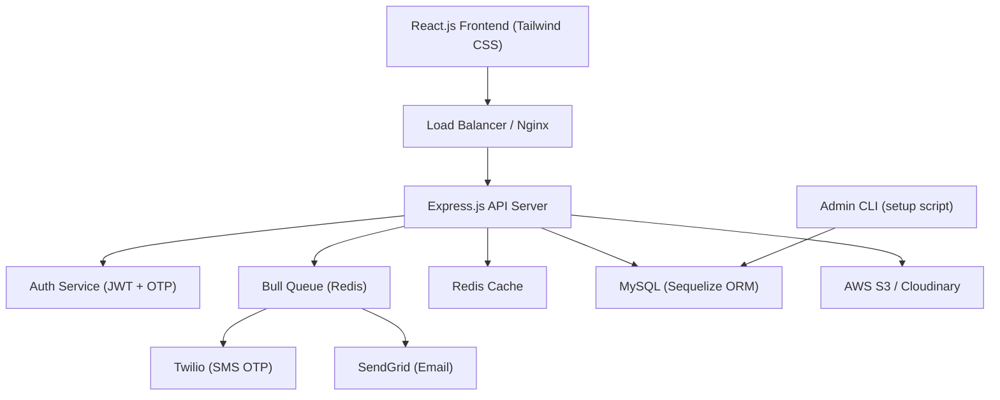
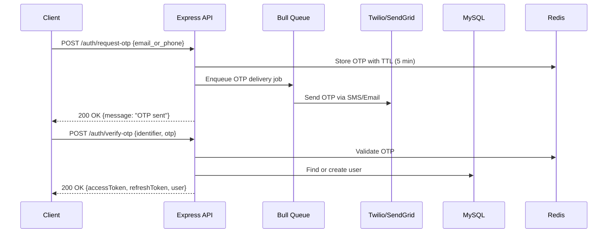
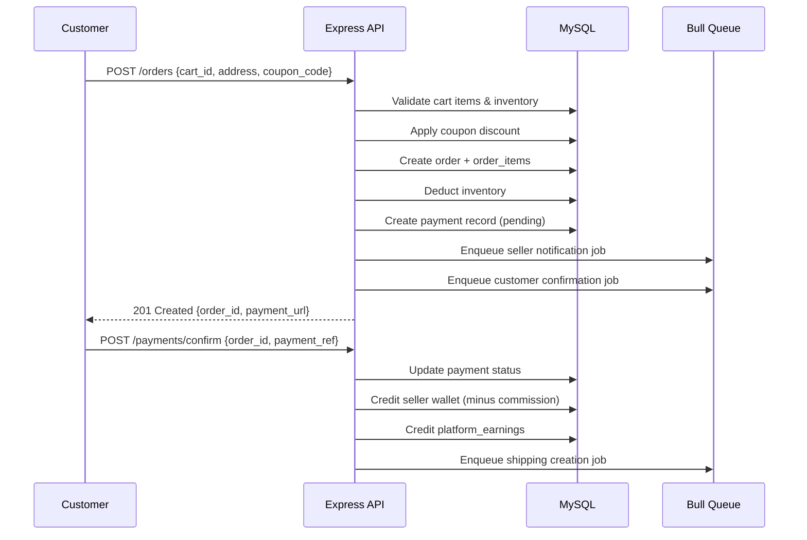

# Design Document: Meesho Marketplace

## Overview

A full-stack multi-vendor ecommerce marketplace platform built with Node.js/Express backend, React.js frontend, and MySQL database. The platform supports three roles — admin, seller, and customer — with features including seller onboarding with KYC, product management with variants, order lifecycle management, wallet/commission system, OTP-based authentication, and a notification pipeline via Twilio/SendGrid.

The system is designed for horizontal scalability using Redis for caching and Bull queues for async processing (OTP delivery, notifications, commission calculations). AWS S3 or Cloudinary handles media storage. All APIs are RESTful and JWT-protected.

## Architecture




## Sequence Diagrams

### OTP Login Flow



### Order Placement Flow




## Components and Interfaces

### Auth Service

**Purpose**: Handles OTP generation/validation, JWT issuance, and role-based access.

**Interface**:
```typescript
interface AuthService {
  requestOtp(identifier: string, channel: 'sms' | 'email'): Promise<void>
  verifyOtp(identifier: string, otp: string): Promise<{ user: User; tokens: TokenPair }>
  refreshToken(refreshToken: string): Promise<TokenPair>
  revokeToken(userId: string): Promise<void>
}

interface TokenPair {
  accessToken: string   // JWT, 15min expiry
  refreshToken: string  // JWT, 7d expiry
}
```

**Responsibilities**:
- Generate 6-digit OTP, store in Redis with 5-min TTL
- Rate-limit OTP requests (max 3/hour per identifier)
- Issue signed JWTs with role claim
- Validate tokens on every protected route via middleware

### User & Role Service

**Purpose**: Manages user accounts, role assignment, and seller profile/KYC.

**Interface**:
```typescript
interface UserService {
  createAdminViaCLI(email: string, password: string): Promise<User>
  getProfile(userId: string): Promise<User>
  updateProfile(userId: string, data: Partial<User>): Promise<User>
}

interface SellerService {
  submitKyc(sellerId: string, kycData: KycData): Promise<SellerProfile>
  approveSeller(sellerId: string, adminId: string): Promise<SellerProfile>
  updateBankDetails(sellerId: string, bankData: BankDetails): Promise<void>
  getEarnings(sellerId: string, filters: DateRange): Promise<SellerEarnings>
}
```

### Product & Inventory Service

**Purpose**: Product CRUD with variant management and inventory tracking.

**Interface**:
```typescript
interface ProductService {
  createProduct(sellerId: string, data: ProductInput): Promise<Product>
  addVariant(productId: string, variant: VariantInput): Promise<ProductVariant>
  updateInventory(variantId: string, quantity: number): Promise<Inventory>
  searchProducts(filters: ProductFilters): Promise<PaginatedResult<Product>>
  uploadMedia(file: Buffer, type: 'image' | 'video'): Promise<string> // returns URL
}
```

### Order Service

**Purpose**: Full order lifecycle from placement to delivery/return.

**Interface**:
```typescript
interface OrderService {
  placeOrder(customerId: string, input: OrderInput): Promise<Order>
  updateStatus(orderId: string, status: OrderStatus, actorId: string): Promise<Order>
  initiateReturn(orderId: string, reason: string): Promise<Return>
  processRefund(returnId: string): Promise<void>
  getOrdersByUser(userId: string, role: Role): Promise<Order[]>
}

type OrderStatus = 'pending' | 'confirmed' | 'shipped' | 'delivered' | 'cancelled' | 'returned'
```

### Wallet & Commission Service

**Purpose**: Manages seller wallets, platform commission, and payouts.

**Interface**:
```typescript
interface WalletService {
  creditSeller(sellerId: string, orderId: string, amount: number): Promise<void>
  debitSeller(sellerId: string, amount: number, reason: string): Promise<void>
  requestWithdrawal(sellerId: string, amount: number): Promise<WithdrawalRequest>
  calculateCommission(orderAmount: number): Promise<{ sellerAmount: number; platformFee: number }>
  getPlatformEarnings(filters: DateRange): Promise<PlatformEarnings>
}
```

### Notification Service

**Purpose**: Async delivery of email/SMS notifications via Bull queue.

**Interface**:
```typescript
interface NotificationService {
  send(userId: string, type: NotificationType, payload: object): Promise<void>
  getNotifications(userId: string): Promise<Notification[]>
  markRead(notificationId: string): Promise<void>
}

type NotificationType = 'otp' | 'order_placed' | 'order_shipped' | 'order_delivered'
  | 'payment_received' | 'kyc_approved' | 'withdrawal_processed' | 'review_received'
```


## Data Models

### ER Diagram (SQL Schema)

```sql
-- Users & Auth
CREATE TABLE users (
  id            CHAR(36)     PRIMARY KEY DEFAULT (UUID()),
  email         VARCHAR(255) UNIQUE,
  phone         VARCHAR(20)  UNIQUE,
  password_hash VARCHAR(255),           -- only for admin CLI-created accounts
  role          ENUM('admin','seller','customer') NOT NULL DEFAULT 'customer',
  is_active     BOOLEAN      NOT NULL DEFAULT TRUE,
  referral_code VARCHAR(20)  UNIQUE,
  referred_by   CHAR(36)     REFERENCES users(id),
  created_at    DATETIME     NOT NULL DEFAULT CURRENT_TIMESTAMP,
  updated_at    DATETIME     NOT NULL DEFAULT CURRENT_TIMESTAMP ON UPDATE CURRENT_TIMESTAMP
);

CREATE TABLE seller_profiles (
  id              CHAR(36)     PRIMARY KEY DEFAULT (UUID()),
  user_id         CHAR(36)     NOT NULL UNIQUE REFERENCES users(id),
  shop_name       VARCHAR(255) NOT NULL,
  description     TEXT,
  logo_url        VARCHAR(500),
  kyc_status      ENUM('pending','submitted','approved','rejected') DEFAULT 'pending',
  kyc_doc_url     VARCHAR(500),
  pan_number      VARCHAR(20),
  gst_number      VARCHAR(20),
  bank_account    VARCHAR(30),
  bank_ifsc       VARCHAR(15),
  bank_name       VARCHAR(100),
  commission_rate DECIMAL(5,2) NOT NULL DEFAULT 10.00,
  created_at      DATETIME     NOT NULL DEFAULT CURRENT_TIMESTAMP,
  updated_at      DATETIME     NOT NULL DEFAULT CURRENT_TIMESTAMP ON UPDATE CURRENT_TIMESTAMP
);

-- Catalog
CREATE TABLE categories (
  id          CHAR(36)     PRIMARY KEY DEFAULT (UUID()),
  name        VARCHAR(100) NOT NULL,
  slug        VARCHAR(100) NOT NULL UNIQUE,
  parent_id   CHAR(36)     REFERENCES categories(id),
  image_url   VARCHAR(500),
  is_active   BOOLEAN      NOT NULL DEFAULT TRUE,
  created_at  DATETIME     NOT NULL DEFAULT CURRENT_TIMESTAMP
);

CREATE TABLE products (
  id            CHAR(36)     PRIMARY KEY DEFAULT (UUID()),
  seller_id     CHAR(36)     NOT NULL REFERENCES seller_profiles(id),
  category_id   CHAR(36)     NOT NULL REFERENCES categories(id),
  name          VARCHAR(255) NOT NULL,
  description   TEXT,
  base_price    DECIMAL(10,2) NOT NULL,
  mrp           DECIMAL(10,2) NOT NULL,
  status        ENUM('draft','active','inactive','rejected') DEFAULT 'draft',
  images        JSON,                   -- array of S3/Cloudinary URLs
  tags          JSON,
  created_at    DATETIME     NOT NULL DEFAULT CURRENT_TIMESTAMP,
  updated_at    DATETIME     NOT NULL DEFAULT CURRENT_TIMESTAMP ON UPDATE CURRENT_TIMESTAMP,
  INDEX idx_seller (seller_id),
  INDEX idx_category (category_id),
  FULLTEXT INDEX ft_search (name, description)
);

CREATE TABLE product_variants (
  id          CHAR(36)     PRIMARY KEY DEFAULT (UUID()),
  product_id  CHAR(36)     NOT NULL REFERENCES products(id) ON DELETE CASCADE,
  sku         VARCHAR(100) NOT NULL UNIQUE,
  size        VARCHAR(50),
  color       VARCHAR(50),
  material    VARCHAR(100),
  price       DECIMAL(10,2) NOT NULL,
  images      JSON,
  is_active   BOOLEAN      NOT NULL DEFAULT TRUE,
  created_at  DATETIME     NOT NULL DEFAULT CURRENT_TIMESTAMP
);

CREATE TABLE inventory (
  id           CHAR(36)  PRIMARY KEY DEFAULT (UUID()),
  variant_id   CHAR(36)  NOT NULL UNIQUE REFERENCES product_variants(id) ON DELETE CASCADE,
  quantity     INT       NOT NULL DEFAULT 0,
  reserved     INT       NOT NULL DEFAULT 0,
  updated_at   DATETIME  NOT NULL DEFAULT CURRENT_TIMESTAMP ON UPDATE CURRENT_TIMESTAMP
);

-- Cart & Orders
CREATE TABLE cart (
  id          CHAR(36)  PRIMARY KEY DEFAULT (UUID()),
  user_id     CHAR(36)  NOT NULL REFERENCES users(id),
  variant_id  CHAR(36)  NOT NULL REFERENCES product_variants(id),
  quantity    INT       NOT NULL DEFAULT 1,
  created_at  DATETIME  NOT NULL DEFAULT CURRENT_TIMESTAMP,
  UNIQUE KEY uq_cart_item (user_id, variant_id)
);

CREATE TABLE orders (
  id               CHAR(36)     PRIMARY KEY DEFAULT (UUID()),
  customer_id      CHAR(36)     NOT NULL REFERENCES users(id),
  status           ENUM('pending','confirmed','processing','shipped','delivered','cancelled','returned') DEFAULT 'pending',
  subtotal         DECIMAL(10,2) NOT NULL,
  discount_amount  DECIMAL(10,2) NOT NULL DEFAULT 0,
  shipping_charge  DECIMAL(10,2) NOT NULL DEFAULT 0,
  total_amount     DECIMAL(10,2) NOT NULL,
  coupon_id        CHAR(36)     REFERENCES coupons(id),
  shipping_address JSON         NOT NULL,
  notes            TEXT,
  created_at       DATETIME     NOT NULL DEFAULT CURRENT_TIMESTAMP,
  updated_at       DATETIME     NOT NULL DEFAULT CURRENT_TIMESTAMP ON UPDATE CURRENT_TIMESTAMP,
  INDEX idx_customer (customer_id),
  INDEX idx_status (status)
);

CREATE TABLE order_items (
  id            CHAR(36)     PRIMARY KEY DEFAULT (UUID()),
  order_id      CHAR(36)     NOT NULL REFERENCES orders(id),
  variant_id    CHAR(36)     NOT NULL REFERENCES product_variants(id),
  seller_id     CHAR(36)     NOT NULL REFERENCES seller_profiles(id),
  quantity      INT          NOT NULL,
  unit_price    DECIMAL(10,2) NOT NULL,
  total_price   DECIMAL(10,2) NOT NULL,
  commission    DECIMAL(10,2) NOT NULL,
  seller_payout DECIMAL(10,2) NOT NULL,
  status        ENUM('pending','confirmed','shipped','delivered','cancelled','returned') DEFAULT 'pending',
  created_at    DATETIME     NOT NULL DEFAULT CURRENT_TIMESTAMP
);

-- Payments & Finance
CREATE TABLE payments (
  id              CHAR(36)     PRIMARY KEY DEFAULT (UUID()),
  order_id        CHAR(36)     NOT NULL REFERENCES orders(id),
  amount          DECIMAL(10,2) NOT NULL,
  method          ENUM('upi','card','netbanking','wallet','cod') NOT NULL,
  status          ENUM('pending','completed','failed','refunded') DEFAULT 'pending',
  gateway_ref     VARCHAR(255),
  gateway_payload JSON,
  created_at      DATETIME     NOT NULL DEFAULT CURRENT_TIMESTAMP,
  updated_at      DATETIME     NOT NULL DEFAULT CURRENT_TIMESTAMP ON UPDATE CURRENT_TIMESTAMP
);

CREATE TABLE wallets (
  id          CHAR(36)     PRIMARY KEY DEFAULT (UUID()),
  user_id     CHAR(36)     NOT NULL UNIQUE REFERENCES users(id),
  balance     DECIMAL(10,2) NOT NULL DEFAULT 0.00,
  updated_at  DATETIME     NOT NULL DEFAULT CURRENT_TIMESTAMP ON UPDATE CURRENT_TIMESTAMP
);

CREATE TABLE seller_earnings (
  id          CHAR(36)     PRIMARY KEY DEFAULT (UUID()),
  seller_id   CHAR(36)     NOT NULL REFERENCES seller_profiles(id),
  order_item_id CHAR(36)   NOT NULL REFERENCES order_items(id),
  gross_amount  DECIMAL(10,2) NOT NULL,
  commission    DECIMAL(10,2) NOT NULL,
  net_amount    DECIMAL(10,2) NOT NULL,
  status        ENUM('pending','settled','withdrawn') DEFAULT 'pending',
  settled_at    DATETIME,
  created_at    DATETIME   NOT NULL DEFAULT CURRENT_TIMESTAMP,
  INDEX idx_seller (seller_id)
);

CREATE TABLE platform_earnings (
  id            CHAR(36)     PRIMARY KEY DEFAULT (UUID()),
  order_item_id CHAR(36)     NOT NULL REFERENCES order_items(id),
  amount        DECIMAL(10,2) NOT NULL,
  created_at    DATETIME     NOT NULL DEFAULT CURRENT_TIMESTAMP
);

-- Shipping & Returns
CREATE TABLE shipping (
  id              CHAR(36)     PRIMARY KEY DEFAULT (UUID()),
  order_id        CHAR(36)     NOT NULL REFERENCES orders(id),
  carrier         VARCHAR(100),
  tracking_number VARCHAR(100),
  status          ENUM('pending','picked_up','in_transit','out_for_delivery','delivered','failed') DEFAULT 'pending',
  estimated_date  DATE,
  delivered_at    DATETIME,
  created_at      DATETIME     NOT NULL DEFAULT CURRENT_TIMESTAMP,
  updated_at      DATETIME     NOT NULL DEFAULT CURRENT_TIMESTAMP ON UPDATE CURRENT_TIMESTAMP
);

CREATE TABLE returns (
  id            CHAR(36)     PRIMARY KEY DEFAULT (UUID()),
  order_item_id CHAR(36)     NOT NULL REFERENCES order_items(id),
  reason        TEXT         NOT NULL,
  status        ENUM('requested','approved','rejected','picked_up','refunded') DEFAULT 'requested',
  refund_amount DECIMAL(10,2),
  images        JSON,
  created_at    DATETIME     NOT NULL DEFAULT CURRENT_TIMESTAMP,
  updated_at    DATETIME     NOT NULL DEFAULT CURRENT_TIMESTAMP ON UPDATE CURRENT_TIMESTAMP
);

-- Engagement
CREATE TABLE reviews (
  id          CHAR(36)  PRIMARY KEY DEFAULT (UUID()),
  product_id  CHAR(36)  NOT NULL REFERENCES products(id),
  user_id     CHAR(36)  NOT NULL REFERENCES users(id),
  order_id    CHAR(36)  NOT NULL REFERENCES orders(id),
  rating      TINYINT   NOT NULL CHECK (rating BETWEEN 1 AND 5),
  title       VARCHAR(255),
  body        TEXT,
  images      JSON,
  is_verified BOOLEAN   NOT NULL DEFAULT FALSE,
  created_at  DATETIME  NOT NULL DEFAULT CURRENT_TIMESTAMP,
  UNIQUE KEY uq_review (product_id, user_id, order_id)
);

CREATE TABLE coupons (
  id              CHAR(36)     PRIMARY KEY DEFAULT (UUID()),
  code            VARCHAR(50)  NOT NULL UNIQUE,
  type            ENUM('percentage','flat') NOT NULL,
  value           DECIMAL(10,2) NOT NULL,
  min_order_value DECIMAL(10,2) NOT NULL DEFAULT 0,
  max_discount    DECIMAL(10,2),
  usage_limit     INT,
  used_count      INT          NOT NULL DEFAULT 0,
  valid_from      DATETIME     NOT NULL,
  valid_until     DATETIME     NOT NULL,
  is_active       BOOLEAN      NOT NULL DEFAULT TRUE,
  created_at      DATETIME     NOT NULL DEFAULT CURRENT_TIMESTAMP
);

CREATE TABLE referrals (
  id            CHAR(36)  PRIMARY KEY DEFAULT (UUID()),
  referrer_id   CHAR(36)  NOT NULL REFERENCES users(id),
  referred_id   CHAR(36)  NOT NULL UNIQUE REFERENCES users(id),
  reward_amount DECIMAL(10,2) NOT NULL DEFAULT 0,
  status        ENUM('pending','rewarded') DEFAULT 'pending',
  created_at    DATETIME  NOT NULL DEFAULT CURRENT_TIMESTAMP
);

-- Support & Notifications
CREATE TABLE notifications (
  id          CHAR(36)     PRIMARY KEY DEFAULT (UUID()),
  user_id     CHAR(36)     NOT NULL REFERENCES users(id),
  type        VARCHAR(50)  NOT NULL,
  title       VARCHAR(255) NOT NULL,
  body        TEXT         NOT NULL,
  is_read     BOOLEAN      NOT NULL DEFAULT FALSE,
  metadata    JSON,
  created_at  DATETIME     NOT NULL DEFAULT CURRENT_TIMESTAMP,
  INDEX idx_user_unread (user_id, is_read)
);

CREATE TABLE support_tickets (
  id          CHAR(36)     PRIMARY KEY DEFAULT (UUID()),
  user_id     CHAR(36)     NOT NULL REFERENCES users(id),
  order_id    CHAR(36)     REFERENCES orders(id),
  subject     VARCHAR(255) NOT NULL,
  description TEXT         NOT NULL,
  status      ENUM('open','in_progress','resolved','closed') DEFAULT 'open',
  priority    ENUM('low','medium','high') DEFAULT 'medium',
  created_at  DATETIME     NOT NULL DEFAULT CURRENT_TIMESTAMP,
  updated_at  DATETIME     NOT NULL DEFAULT CURRENT_TIMESTAMP ON UPDATE CURRENT_TIMESTAMP
);
```


## Folder Structure

```
meesho-marketplace/
├── backend/
│   ├── src/
│   │   ├── config/
│   │   │   ├── database.js          # Sequelize connection
│   │   │   ├── redis.js             # Redis client
│   │   │   ├── queue.js             # Bull queue setup
│   │   │   └── storage.js           # S3/Cloudinary config
│   │   ├── models/                  # Sequelize models (one per table)
│   │   │   ├── User.js
│   │   │   ├── SellerProfile.js
│   │   │   ├── Product.js
│   │   │   ├── ProductVariant.js
│   │   │   ├── Inventory.js
│   │   │   ├── Cart.js
│   │   │   ├── Order.js
│   │   │   ├── OrderItem.js
│   │   │   ├── Payment.js
│   │   │   ├── Wallet.js
│   │   │   ├── SellerEarning.js
│   │   │   ├── PlatformEarning.js
│   │   │   ├── Shipping.js
│   │   │   ├── Return.js
│   │   │   ├── Review.js
│   │   │   ├── Coupon.js
│   │   │   ├── Referral.js
│   │   │   ├── Notification.js
│   │   │   ├── SupportTicket.js
│   │   │   ├── Category.js
│   │   │   └── index.js             # associations
│   │   ├── routes/
│   │   │   ├── auth.routes.js
│   │   │   ├── user.routes.js
│   │   │   ├── seller.routes.js
│   │   │   ├── product.routes.js
│   │   │   ├── category.routes.js
│   │   │   ├── cart.routes.js
│   │   │   ├── order.routes.js
│   │   │   ├── payment.routes.js
│   │   │   ├── shipping.routes.js
│   │   │   ├── return.routes.js
│   │   │   ├── review.routes.js
│   │   │   ├── coupon.routes.js
│   │   │   ├── wallet.routes.js
│   │   │   ├── notification.routes.js
│   │   │   ├── support.routes.js
│   │   │   ├── referral.routes.js
│   │   │   └── admin.routes.js
│   │   ├── services/
│   │   │   ├── auth.service.js
│   │   │   ├── otp.service.js
│   │   │   ├── user.service.js
│   │   │   ├── seller.service.js
│   │   │   ├── product.service.js
│   │   │   ├── inventory.service.js
│   │   │   ├── cart.service.js
│   │   │   ├── order.service.js
│   │   │   ├── payment.service.js
│   │   │   ├── wallet.service.js
│   │   │   ├── commission.service.js
│   │   │   ├── shipping.service.js
│   │   │   ├── return.service.js
│   │   │   ├── review.service.js
│   │   │   ├── coupon.service.js
│   │   │   ├── notification.service.js
│   │   │   ├── referral.service.js
│   │   │   ├── support.service.js
│   │   │   └── storage.service.js
│   │   ├── workers/
│   │   │   ├── notification.worker.js
│   │   │   ├── otp.worker.js
│   │   │   └── commission.worker.js
│   │   ├── middleware/
│   │   │   ├── auth.middleware.js    # JWT verify + role guard
│   │   │   ├── rateLimiter.js
│   │   │   ├── upload.middleware.js  # multer + S3
│   │   │   └── errorHandler.js
│   │   ├── validators/              # Joi/Zod schemas
│   │   │   ├── auth.validator.js
│   │   │   ├── product.validator.js
│   │   │   └── order.validator.js
│   │   ├── utils/
│   │   │   ├── jwt.js
│   │   │   ├── otp.js
│   │   │   ├── pagination.js
│   │   │   └── response.js
│   │   └── app.js                   # Express app setup
│   ├── scripts/
│   │   └── create-admin.js          # CLI: node scripts/create-admin.js
│   ├── migrations/                  # Sequelize migrations
│   ├── seeders/                     # Category seeds
│   ├── .env.example
│   └── server.js                    # Entry point
│
└── frontend/
    ├── src/
    │   ├── api/                     # Axios instances per domain
    │   ├── components/
    │   │   ├── common/              # Button, Input, Modal, etc.
    │   │   ├── product/             # ProductCard, VariantSelector
    │   │   ├── order/               # OrderTimeline, OrderCard
    │   │   └── layout/              # Navbar, Sidebar, Footer
    │   ├── pages/
    │   │   ├── auth/                # Login, OTP verify
    │   │   ├── customer/            # Home, Product, Cart, Checkout, Orders
    │   │   ├── seller/              # Dashboard, Products, Orders, Earnings
    │   │   └── admin/               # Dashboard, Users, Sellers, Products, Earnings
    │   ├── store/                   # Redux Toolkit slices
    │   ├── hooks/                   # useAuth, useCart, useNotifications
    │   └── utils/
    ├── tailwind.config.js
    └── vite.config.js
```


## Detailed API Endpoints

### Authentication — `/api/auth`

| Method | Endpoint | Auth | Description |
|--------|----------|------|-------------|
| POST | `/auth/request-otp` | Public | Send OTP to email or phone |
| POST | `/auth/verify-otp` | Public | Verify OTP, return JWT pair |
| POST | `/auth/refresh` | Public | Refresh access token |
| POST | `/auth/logout` | JWT | Revoke refresh token |

**POST /auth/request-otp**
```json
// Request
{ "identifier": "9876543210", "channel": "sms" }
// OR
{ "identifier": "user@example.com", "channel": "email" }

// Response 200
{ "message": "OTP sent", "expires_in": 300 }
```

**POST /auth/verify-otp**
```json
// Request
{ "identifier": "9876543210", "otp": "482910" }

// Response 200
{
  "accessToken": "eyJ...",
  "refreshToken": "eyJ...",
  "user": { "id": "uuid", "role": "customer", "email": null, "phone": "9876543210" }
}
```

---

### Users — `/api/users`

| Method | Endpoint | Auth | Description |
|--------|----------|------|-------------|
| GET | `/users/me` | JWT | Get own profile |
| PUT | `/users/me` | JWT | Update profile |
| GET | `/users/:id` | Admin | Get any user |
| GET | `/users` | Admin | List users (paginated) |
| PATCH | `/users/:id/status` | Admin | Activate/deactivate user |

---

### Sellers — `/api/sellers`

| Method | Endpoint | Auth | Description |
|--------|----------|------|-------------|
| POST | `/sellers/onboard` | Customer JWT | Register as seller |
| PUT | `/sellers/kyc` | Seller JWT | Submit KYC documents |
| PUT | `/sellers/bank` | Seller JWT | Update bank details |
| GET | `/sellers/me` | Seller JWT | Get own seller profile |
| GET | `/sellers` | Admin | List all sellers |
| PATCH | `/sellers/:id/kyc` | Admin | Approve/reject KYC |
| PATCH | `/sellers/:id/commission` | Admin | Set commission rate |

**POST /sellers/onboard**
```json
// Request
{ "shop_name": "My Store", "description": "Handmade goods" }

// Response 201
{ "id": "uuid", "shop_name": "My Store", "kyc_status": "pending" }
```

**PUT /sellers/kyc** (multipart/form-data)
```
Fields: pan_number, gst_number, kyc_doc (file)
Response 200: { "kyc_status": "submitted" }
```

---

### Products — `/api/products`

| Method | Endpoint | Auth | Description |
|--------|----------|------|-------------|
| GET | `/products` | Public | List/search products |
| GET | `/products/:id` | Public | Product detail with variants |
| POST | `/products` | Seller JWT | Create product |
| PUT | `/products/:id` | Seller JWT | Update product |
| DELETE | `/products/:id` | Seller JWT | Delete product |
| POST | `/products/:id/variants` | Seller JWT | Add variant |
| PUT | `/products/:id/variants/:vid` | Seller JWT | Update variant |
| POST | `/products/:id/images` | Seller JWT | Upload images (multipart) |
| PATCH | `/products/:id/status` | Admin | Approve/reject product |

**GET /products** (query params)
```
?q=saree&category=uuid&min_price=100&max_price=5000
&sort=price_asc|price_desc|newest|rating
&page=1&limit=20
```

**POST /products**
```json
// Request
{
  "category_id": "uuid",
  "name": "Cotton Saree",
  "description": "...",
  "base_price": 499,
  "mrp": 999,
  "tags": ["saree", "cotton"],
  "variants": [
    { "sku": "SAR-RED-M", "color": "Red", "size": "M", "price": 499, "quantity": 50 }
  ]
}

// Response 201
{ "id": "uuid", "status": "draft", "variants": [...] }
```

---

### Cart — `/api/cart`

| Method | Endpoint | Auth | Description |
|--------|----------|------|-------------|
| GET | `/cart` | Customer JWT | Get cart |
| POST | `/cart` | Customer JWT | Add item |
| PUT | `/cart/:itemId` | Customer JWT | Update quantity |
| DELETE | `/cart/:itemId` | Customer JWT | Remove item |
| DELETE | `/cart` | Customer JWT | Clear cart |

---

### Orders — `/api/orders`

| Method | Endpoint | Auth | Description |
|--------|----------|------|-------------|
| POST | `/orders` | Customer JWT | Place order |
| GET | `/orders` | JWT | List orders (role-filtered) |
| GET | `/orders/:id` | JWT | Order detail |
| PATCH | `/orders/:id/status` | Seller/Admin JWT | Update order status |
| POST | `/orders/:id/cancel` | Customer JWT | Cancel order |

**POST /orders**
```json
// Request
{
  "shipping_address": {
    "name": "[name]", "phone": "[phone]",
    "line1": "[address]", "city": "Mumbai",
    "state": "Maharashtra", "pincode": "400001"
  },
  "coupon_code": "SAVE50",
  "payment_method": "upi"
}

// Response 201
{
  "order_id": "uuid",
  "total_amount": 948,
  "payment_url": "https://payment-gateway.com/pay/uuid"
}
```

---

### Payments — `/api/payments`

| Method | Endpoint | Auth | Description |
|--------|----------|------|-------------|
| POST | `/payments/confirm` | Customer JWT | Confirm payment after gateway |
| POST | `/payments/webhook` | Public (HMAC) | Payment gateway webhook |
| GET | `/payments/:orderId` | JWT | Payment status |

---

### Shipping — `/api/shipping`

| Method | Endpoint | Auth | Description |
|--------|----------|------|-------------|
| GET | `/shipping/:orderId` | JWT | Get tracking info |
| PUT | `/shipping/:orderId` | Seller/Admin JWT | Update tracking |

---

### Returns — `/api/returns`

| Method | Endpoint | Auth | Description |
|--------|----------|------|-------------|
| POST | `/returns` | Customer JWT | Initiate return |
| GET | `/returns` | JWT | List returns |
| PATCH | `/returns/:id/status` | Seller/Admin JWT | Approve/reject return |

**POST /returns**
```json
{
  "order_item_id": "uuid",
  "reason": "Wrong size delivered",
  "images": ["base64_or_upload"]
}
```

---

### Reviews — `/api/reviews`

| Method | Endpoint | Auth | Description |
|--------|----------|------|-------------|
| POST | `/reviews` | Customer JWT | Submit review (post-delivery only) |
| GET | `/reviews/product/:id` | Public | Product reviews |
| DELETE | `/reviews/:id` | Admin | Remove review |

---

### Coupons — `/api/coupons`

| Method | Endpoint | Auth | Description |
|--------|----------|------|-------------|
| POST | `/coupons` | Admin JWT | Create coupon |
| GET | `/coupons` | Admin JWT | List coupons |
| POST | `/coupons/validate` | Customer JWT | Validate coupon for cart |
| DELETE | `/coupons/:id` | Admin JWT | Delete coupon |

---

### Wallet — `/api/wallet`

| Method | Endpoint | Auth | Description |
|--------|----------|------|-------------|
| GET | `/wallet` | JWT | Get wallet balance + history |
| POST | `/wallet/withdraw` | Seller JWT | Request withdrawal |
| GET | `/wallet/withdrawals` | Admin JWT | List withdrawal requests |
| PATCH | `/wallet/withdrawals/:id` | Admin JWT | Approve/reject withdrawal |

---

### Notifications — `/api/notifications`

| Method | Endpoint | Auth | Description |
|--------|----------|------|-------------|
| GET | `/notifications` | JWT | Get notifications |
| PATCH | `/notifications/:id/read` | JWT | Mark as read |
| PATCH | `/notifications/read-all` | JWT | Mark all as read |

---

### Support Tickets — `/api/support`

| Method | Endpoint | Auth | Description |
|--------|----------|------|-------------|
| POST | `/support` | JWT | Create ticket |
| GET | `/support` | JWT | List own tickets |
| GET | `/support/:id` | JWT | Ticket detail |
| PATCH | `/support/:id/status` | Admin JWT | Update ticket status |

---

### Referrals — `/api/referrals`

| Method | Endpoint | Auth | Description |
|--------|----------|------|-------------|
| GET | `/referrals` | JWT | Get referral stats |
| POST | `/referrals/apply` | Customer JWT | Apply referral code at signup |

---

### Admin — `/api/admin`

| Method | Endpoint | Auth | Description |
|--------|----------|------|-------------|
| GET | `/admin/dashboard` | Admin JWT | Platform stats summary |
| GET | `/admin/earnings` | Admin JWT | Platform earnings report |
| PATCH | `/admin/config/commission` | Admin JWT | Update default commission rate |


## Key Service Layer Functions

### auth.service.js

```javascript
// Generate OTP, store in Redis with TTL, enqueue delivery
async function requestOtp(identifier, channel) {
  // PRECONDITION: identifier is valid email or 10-digit phone
  const otp = generateSixDigitOtp()
  const key = `otp:${identifier}`
  await redis.setex(key, 300, otp)          // 5-min TTL
  await otpQueue.add({ identifier, otp, channel })
  // POSTCONDITION: OTP stored in Redis, delivery job enqueued
}

// Verify OTP, issue JWT pair
async function verifyOtp(identifier, otp) {
  // PRECONDITION: identifier and otp are non-empty strings
  const stored = await redis.get(`otp:${identifier}`)
  if (!stored || stored !== otp) throw new UnauthorizedError('Invalid or expired OTP')
  await redis.del(`otp:${identifier}`)
  const [user] = await User.findOrCreate({ where: { [isEmail(identifier) ? 'email' : 'phone']: identifier } })
  const tokens = generateTokenPair(user)
  // POSTCONDITION: OTP deleted from Redis, JWT pair returned
  return { user, tokens }
}
```

### commission.service.js

```javascript
// Calculate seller payout and platform fee for an order item
async function calculateCommission(sellerId, grossAmount) {
  // PRECONDITION: grossAmount > 0, sellerId references valid seller
  const seller = await SellerProfile.findByPk(sellerId)
  const rate = seller.commission_rate / 100
  const platformFee = parseFloat((grossAmount * rate).toFixed(2))
  const sellerPayout = parseFloat((grossAmount - platformFee).toFixed(2))
  // POSTCONDITION: platformFee + sellerPayout === grossAmount (within rounding)
  return { platformFee, sellerPayout }
}

// Settle earnings after delivery confirmation
async function settleOrderItem(orderItemId) {
  // PRECONDITION: order_item status === 'delivered'
  const item = await OrderItem.findByPk(orderItemId, { include: [SellerProfile] })
  const { platformFee, sellerPayout } = await calculateCommission(item.seller_id, item.total_price)
  await sequelize.transaction(async (t) => {
    await SellerEarning.create({ seller_id: item.seller_id, order_item_id: orderItemId,
      gross_amount: item.total_price, commission: platformFee, net_amount: sellerPayout,
      status: 'settled', settled_at: new Date() }, { transaction: t })
    await Wallet.increment('balance', { by: sellerPayout, where: { user_id: item.seller.user_id }, transaction: t })
    await PlatformEarning.create({ order_item_id: orderItemId, amount: platformFee }, { transaction: t })
  })
  // POSTCONDITION: seller wallet credited, platform earning recorded, all in single transaction
}
```

### order.service.js

```javascript
// Place order with inventory reservation and coupon application
async function placeOrder(customerId, { shipping_address, coupon_code, payment_method }) {
  // PRECONDITION: cart is non-empty, all variants have sufficient inventory
  const cartItems = await Cart.findAll({ where: { user_id: customerId }, include: [ProductVariant] })
  if (!cartItems.length) throw new BadRequestError('Cart is empty')

  return sequelize.transaction(async (t) => {
    // Validate and reserve inventory
    for (const item of cartItems) {
      const inv = await Inventory.findOne({ where: { variant_id: item.variant_id }, lock: true, transaction: t })
      const available = inv.quantity - inv.reserved
      if (available < item.quantity) throw new BadRequestError(`Insufficient stock for ${item.variant.sku}`)
      await inv.increment('reserved', { by: item.quantity, transaction: t })
    }

    // Apply coupon
    let discount = 0
    let couponId = null
    if (coupon_code) {
      const coupon = await validateCoupon(coupon_code, subtotal)
      discount = computeDiscount(coupon, subtotal)
      couponId = coupon.id
      await coupon.increment('used_count', { transaction: t })
    }

    // Create order and items
    const order = await Order.create({ customer_id: customerId, subtotal, discount_amount: discount,
      total_amount: subtotal - discount + shippingCharge, coupon_id: couponId,
      shipping_address, status: 'pending' }, { transaction: t })

    for (const item of cartItems) {
      const { platformFee, sellerPayout } = await calculateCommission(item.variant.product.seller_id, item.total_price)
      await OrderItem.create({ order_id: order.id, variant_id: item.variant_id,
        seller_id: item.variant.product.seller_id, quantity: item.quantity,
        unit_price: item.variant.price, total_price: item.total_price,
        commission: platformFee, seller_payout: sellerPayout }, { transaction: t })
    }

    await Cart.destroy({ where: { user_id: customerId }, transaction: t })
    // POSTCONDITION: order created, inventory reserved, cart cleared
    return order
  })
}
```

## Error Handling

### Error Scenarios

**Authentication Errors**
- Condition: OTP expired or invalid
- Response: `401 Unauthorized { error: "Invalid or expired OTP" }`
- Recovery: Client prompts user to request a new OTP

**Inventory Conflict**
- Condition: Race condition depletes stock between cart add and order placement
- Response: `409 Conflict { error: "Insufficient stock", sku: "..." }`
- Recovery: Client refreshes cart, highlights out-of-stock items

**Payment Webhook Failure**
- Condition: Gateway webhook arrives out of order or duplicate
- Response: `200 OK` (always acknowledge to gateway), idempotency key prevents double-processing
- Recovery: Reconciliation job runs every 15 minutes to catch missed webhooks

**KYC Rejection**
- Condition: Admin rejects seller KYC
- Response: Seller notified via notification + email with rejection reason
- Recovery: Seller can resubmit with corrected documents

## Testing Strategy

### Unit Testing Approach

Test each service function in isolation with mocked DB and Redis. Key test cases:
- `calculateCommission`: verify `platformFee + sellerPayout === grossAmount` for various rates
- `verifyOtp`: expired OTP returns 401, valid OTP returns token pair
- `placeOrder`: insufficient inventory throws 409, coupon discount applied correctly

### Property-Based Testing Approach

**Property Test Library**: fast-check

Properties to verify:
- For any `grossAmount > 0` and `rate ∈ [0, 100]`: `commission + payout === grossAmount`
- For any valid cart, `order.total === sum(items) - discount + shipping`
- OTP generation always produces exactly 6 digits

### Integration Testing Approach

- Full order flow: cart → place order → payment confirm → status updates → wallet credit
- Auth flow: request OTP → verify OTP → access protected route → refresh token
- Return flow: initiate return → approve → refund credited to wallet

## Security Considerations

- JWT access tokens expire in 15 minutes; refresh tokens in 7 days, stored in httpOnly cookies
- OTP rate-limited to 3 requests/hour per identifier via Redis counter
- Admin accounts created only via CLI script with bcrypt-hashed passwords — no API endpoint for admin registration
- Payment webhook endpoints validated via HMAC signature from gateway
- All file uploads scanned for MIME type before S3/Cloudinary upload; max 5MB per image
- SQL injection prevented by Sequelize parameterized queries
- Seller KYC documents stored in private S3 bucket with signed URL access only
- CORS restricted to frontend domain in production

## Performance Considerations

- Product search uses MySQL FULLTEXT index; migrate to Elasticsearch if catalog exceeds 500k products
- Redis caches product listings (TTL 5 min) and category trees (TTL 1 hour)
- Bull queues decouple notification delivery from request path — OTP delivery target < 3s
- Inventory reservation uses row-level locking (`SELECT ... FOR UPDATE`) inside transactions to prevent overselling
- Pagination enforced on all list endpoints (default 20, max 100)
- Images served via CDN (CloudFront or Cloudinary transformations)

## Dependencies

| Package | Purpose |
|---------|---------|
| express | HTTP server |
| sequelize + mysql2 | ORM + MySQL driver |
| jsonwebtoken | JWT signing/verification |
| bcryptjs | Password hashing (admin CLI) |
| ioredis | Redis client |
| bull | Job queue |
| twilio | SMS OTP delivery |
| @sendgrid/mail | Email delivery |
| multer + @aws-sdk/client-s3 | File upload to S3 |
| cloudinary | Alternative media storage |
| joi | Request validation |
| helmet | HTTP security headers |
| express-rate-limit | API rate limiting |
| winston | Structured logging |
| **Frontend** | |
| react + react-router-dom | SPA routing |
| @reduxjs/toolkit | State management |
| axios | HTTP client |
| tailwindcss | Utility-first CSS |
| react-query | Server state / caching |
| react-hook-form | Form management |
